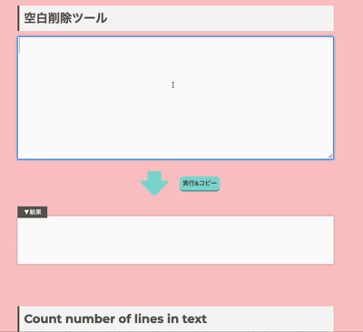
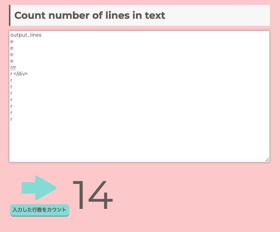
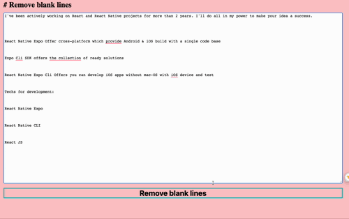
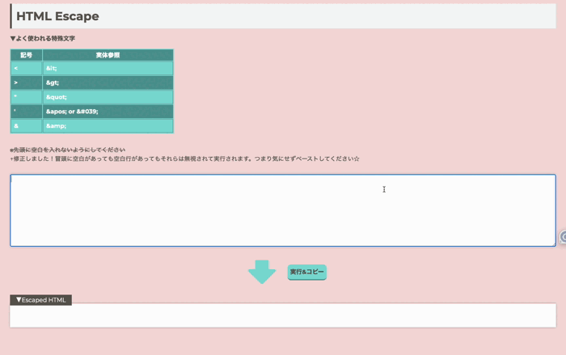
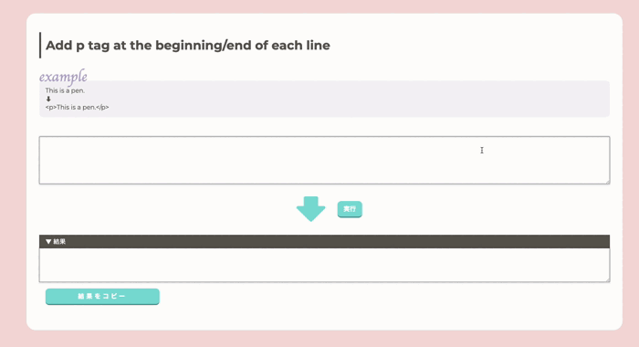
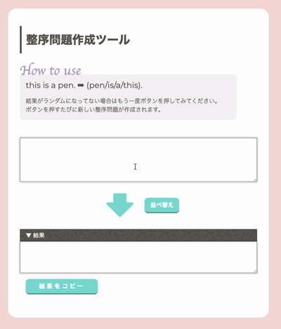

# JavaScriptで作る便利ツール

気まぐれに自分が欲しいツールを自作しています。正規表現便利！

[Dockerを使用して、ローカルのHTMLファイルをWebサーバー上でホストしてみました](./blog/docker.md)

## 空白削除ツール

文字列中の空白を除去できるツールを作りました。ボタンを押すと自動でクリップボードに結果が保存されます。

## Count number of lines in text

何行あるかわかります。

## Remove blank lines

空行を取り除くことができます。

## HTML Escape/UnEscape

- HTMLをエスケープしたいときに便利です。アンエスケープ機能も追加しときました。
- 勢い余って冒頭に空白があったままペーストしてしまうことがあったので、その冒頭の空白はあったとしても無視して実行されるように改良しました

## Add p tag at the beginning/end of each line

- 出力は改行されていません。VSCodeなどのエディタで自動フォーマットすればいいかな、と思います(textarea内での改行の仕方がわかれば直すかもです！）

## Shuffle Words Generator

- 英語の学習用に作りました。