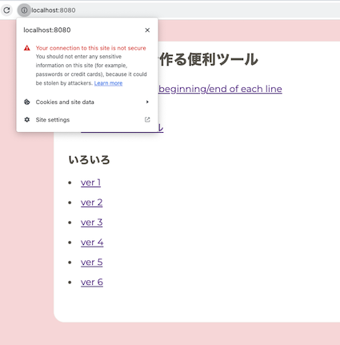
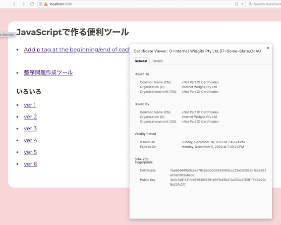

# opensslコマンドでSSL自己証明書(オレオレ証明書)を作成

[動画：サーバ証明書　オレオレ証明書で遊ぼう](https://www.youtube.com/watch?v=hxlQei0VFrg&ab_channel=%E3%81%BE%E3%81%95%E3%82%8B%E3%81%AE%E5%8B%89%E5%BC%B7%E9%83%A8%E5%B1%8B)

## ゴール

HTTPSで暗号通信をして、``https://localhost:8080``にアクセスできるようにする。

| before | after |
| ------------ | -----------|
|       |  | 

## サーバーで直接生成する方法 (WIP)

```sh
docker container exec -it js-basics-container bash

root@e2791505f49a:/# mkdir /etc/nginx/ssl
root@e2791505f49a:/# openssl genrsa -out /etc/nginx/ssl/server.key 2048
bash: openssl: command not found
```

実行しようとしたコンテナ内に openssl コマンドがインストールされていませんでした。openssl はデフォルトで Nginx イメージに含まれていないため、このコマンドを使用するには、まず openssl をインストールする必要があります。

Dockerfileを以下のように書き換えます

```sh
FROM nginx:latest

RUN apt-get update && apt-get install -y openssl

COPY ./src /usr/share/nginx/html

EXPOSE 80
```

改めて作成したコンテナに入って秘密鍵や証明書を配置するためのディレクトリを作成する。

```sh
# 秘密鍵を作成
openssl genrsa -out /etc/nginx/ssl/server.key 2048

# CSR（Certificate Signing Request）を作成
# Country Nameなどを聞かれますが、自己証明書なのでここは全てEnterキーで飛ばしてok
openssl req -new -key /etc/nginx/ssl/server.key -out /etc/nginx/ssl/server.csr

# CRT（SSLサーバ証明書）を作成
openssl x509 -days 3650 -req -signkey /etc/nginx/ssl/server.key -in /etc/nginx/ssl/server.csr -out /etc/nginx/ssl/server.crt
```

CRTが作成されたことを確認

```sh
ls -F /etc/nginx/ssl/
server.crt  server.csr	server.key
```

エディタ(vimかnano)をインストールしてnginxの設定ファイル（default.conf）を編集

```sh
apt-get update
apt-get install nano

nano /etc/nginx/conf.d/ssl.conf
```

```txt
# cat /etc/nginx/conf.d/ssl.conf

server {
    listen 443 default ssl;
    root   /usr/share/nginx/html;
    index  index.html index.htm;
    ssl on;
    ssl_certificate     /etc/nginx/ssl/server.crt;
    ssl_certificate_key /etc/nginx/ssl/server.key;
}
```

nginxの設定を再読み込み

```sh
service nginx reload
```

## ローカルで生成してサーバーにコピーする方法(こっちの方がいいかな)

[Dockerを使ってローカルに立てたNginxでHTTPS通信する方法](https://www.engilaboo.com/nginx-docker-https/)

1. ローカルマシンで openssl を使用して秘密鍵、CSR、自己署名証明書を生成
2. docker cp コマンドなどを使用して、生成したファイルをコンテナにコピー
3. コンテナ内でNginxの設定ファイルを編集して、コピーした証明書を使用するように設定

```txt
docker container exec -it js-basics-container bash

root@630cb8efe9f7:/# cat /etc/nginx/conf.d/default.conf
server {
    listen       80;
    listen  [::]:80;
    server_name  localhost;

    #access_log  /var/log/nginx/host.access.log  main;

    location / {
        root   /usr/share/nginx/html;
        index  index.html index.htm;
    }

   ...略...
```

上記より「/usr/share/nginx/html」がindex.htmlのあるディレクトリ位置だとわかる。

```sh
mkdir ssl
cd ssl

# 秘密鍵
openssl genrsa -aes128 2048 > server.key

# CSR（Certificate Signing Request）を作成
# Country Nameなどを聞かれますが、自己証明書なのでここは全てEnterキーで飛ばしてok
openssl req -new -key server.key > server.csr

openssl x509 -in server.csr -days 365 -req -signkey server.key > server.crt

# 1-2 のパスワードを使用
echo 1qazxsw2 > server.password

ls -F
server.crt		server.csr		server.key		server.password
```