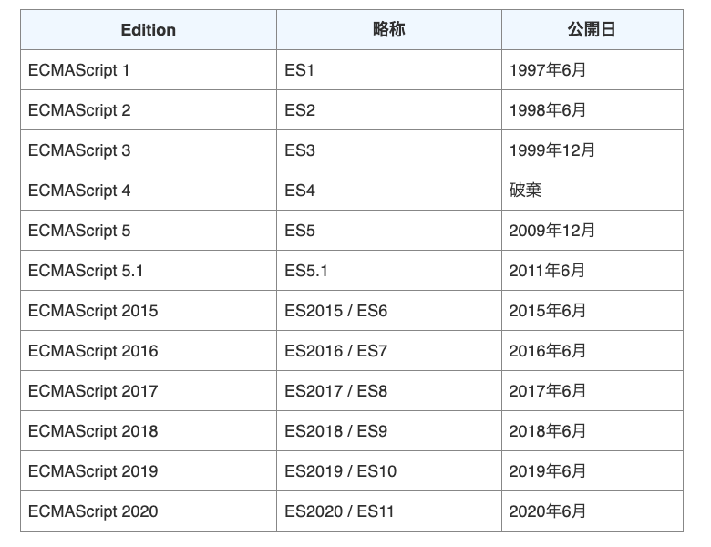

# js -1

## 問題1
let,constを使わず(つまりECMAScript2015以前の書き方)以下の出力を出せ
※letを使えば簡単
```
output: 0
output: 1
output: 2
```


## Solution
```js
var funcsArray = [];

for (var i = 0; i < 3; i++) {
  funcsArray[i] = (function (index) {
    return function () {
      console.log("output: " + index);
    };
  })(i);
  
}

for (var j = 0; j < 3; j++) {
  funcsArray[j]();
}
```
## キーワード
- anonymous function
- immediately invoked function expression (IIFE: pronounced "iffy",/ˈɪf.i/) 
- function scope
- block scope

## ヒント1
```js
var func = [];

for (var i = 0; i < 3; i++) {
  func[i] = function() {
    console.log("output:", i);
  };
}
for (var j = 0; j < 3; j++) {
  func[j]();
}
```

Question: <br>
上記の出力は何か?<br>


Answer:<br>
`output: 3`が三回出力される <br>

考察: <br>

## ヒント2
>Perhaps the greatest benefit of using arrow functions is with methods like `setTimeout()` and `EventTarget.prototype.addEventListener()` that usually require some kind of closure, call(), apply(), or bind() to ensure that the function is executed in the proper scope.[^4]

With traditional function expressions, code like this does not work as expected:
```js
const obj = {
  count: 10,
  doSomethingLater() {
    setTimeout(function () {
      // (1)
      this.count++;
      console.log(this.count);
    }, 300);
  },
};

obj.doSomethingLater(); // logs "NaN", because the property "count" is not in the window scope.

```
(1)<br>
Question: <br>
Where does the function executes ?

Answer: <br>
the function executes on the window scope


With arrow functions, the this scope is more easily preserved:
```js
const obj = {
  count: 10,
  doSomethingLater() {
    // (2)
    setTimeout(() => {
      // Since the arrow function doesn't have its own binding and
      // setTimeout (as a function call) doesn't create a binding
      // itself, the "obj" context of the outer method is used.
      this.count++;
      console.log(this.count);
    }, 300);
  },
};

obj.doSomethingLater(); // logs 11
```
(2)<br>
Question: <br>
The method syntax binds "this" to where?

Answer: <br>
The method syntax binds "this" to the "obj" context.
## var is called as function scope
There is no block scope in JavaScript - only function scope (ECMAScript2015以前)

>Function Scope:  <br>
When a variable is declared inside a function, it is only accessible within that function and cannot be used outside that function.

>Block Scope:  <br>
A variable when declared inside the `if` or `switch` conditions or inside `for` or `while` loops, are accessible within that particular condition or loop. To be concise the variables declared inside the curly braces are called as within block scope.

>var:  <br>
var is called as `function scope` that is if a variable is declared using var keyword it will be accessible throughout the function.

>let & const:  <br>
let & const are also called as block scope that is they are accessible within that particular block. 


## 問題2
You've written the code shown to log a set of consecutive values, but it instead results in the value 5, 5, 5, and 5 being logged to the console. Which revised version of the code would result in the value 1, 2, 3 and 4 being logged?

A:
```js
for (var i = 1; i <= 4; i++) {
  setTimeout(function () {
    console.log(i);
  }, i * 10000);
}
```
B:
```js
for (var i = 1; i <= 4; i++) {
  (function (i) {
    setTimeout(function () {
      console.log(j);
    }, j * 1000);
  })(j);
}
```

C:
```js
for (var i = 1; i <= 4; i++) {
  (function (j) {
    setTimeout(function () {
      console.log(j);
    }, j * 1000);
  })(i);
}
```


# anonymous function[^3]
An anonymous function is a function without a name. 
```js
(function () {
   //...
});
```
>Note that if you don’t place the anonymous function inside the (), you’ll get a syntax error. ***The ()makes the anonymous function an expression that returns a function object.***

>In practice, you often pass anonymous functions as arguments to other functions. For example:

```js
setTimeout(function() {
    console.log('Execute later after 1 second')
}, 1000);
```
# function expressions vs arrow functions [^4]
Note: Traditional function expressions and arrow functions have more differences than their syntax. 

```js
// Traditional anonymous function
(function (a) {
  return a + 100;
});

// 1. Remove the word "function" and place arrow between the argument and opening body bracket
(a) => {
  return a + 100;
};

// 2. Remove the body braces and word "return" — the return is implied.
(a) => a + 100;

// 3. Remove the parameter parentheses
a => a + 100;
```

The parentheses can only be omitted if the function has a single simple parameter. 
```js
(a, b) => a + b + 100;
```

The braces can only be omitted if the function directly returns an expression. 
```js
(a, b) => {
  const chuck = 42;
  return a + b + chuck;
};
```

***Arrow functions are always unnamed.*** If the arrow function needs to call itself, use a named function expression instead. You can also assign the arrow function to a variable so it has a name.
```js
// Traditional Function
function bob(a) {
  return a + 100;
}

// Arrow Function
const bob2 = (a) => a + 100;
```

### Arrow functions cannot be used as methods
Arrow function expressions should only be used for non-method functions because they do not have their own this. Let's see what happens when we try to use them as methods:
```js
"use strict";

const obj = {
  i: 10,
  b: () => console.log(this.i, this), //<---
  c() {
    console.log(this.i, this);
  },
};

obj.b(); // logs undefined, Window { /* … */ } (or the global object)
obj.c(); // logs 10, Object { /* … */ }
```

### auto-bound methods
```js
class C {
  a = 1;
  autoBoundMethod = () => {
    console.log(this.a);
  };
}

const c = new C();
c.autoBoundMethod(); // 1
const { autoBoundMethod } = c;
autoBoundMethod(); // 1
// If it were a normal method, it should be undefined in this case
```

Arrow function properties are often said to be "auto-bound methods", because the equivalent with normal methods is:
```js
class C {
  a = 1;
  constructor() {
    this.method = this.method.bind(this);
  }
  method() {
    console.log(this.a);
  }
}
```

## 問題３
```js
var x = 10; 
function A(){
  console.log(x);  
}
function B(){
  var x = 1000;  //ここでもxが定義されている
  A();  
}
A();  // <---(1)
B(); // <---(2)
```
Question:<br>
(1),(2)それぞれの出力は?

### キーワード
- ダイナミックスコープ
- レキシカルスコープ

Answer:<br>
両方とも10


# 余談
## CommonJS [^1]
>CommonJS is a project with the goal to establish conventions on the module ecosystem for JavaScript outside of the web browser.

>The project was started by Mozilla engineer Kevin Dangoor in January, 2009 and initially named ServerJS.
>In August 2009, the project was renamed CommonJS to show the broader applicability of the APIs.

>CommonJS's module specification is widely used today, in particular for `server-side` JavaScript programming with Node.js.
>It is also used in the development of `browser-side` JavaScript, but the code must be packaged with a transpiler since browsers don't support CommonJS.

## JavaScriptとECMAScriptの違い[^2]
JavaScript の基本部分の仕様を定めているのが ECMAScript です。




[^1]:https://en.wikipedia.org/wiki/CommonJS
[^2]: https://www.javadrive.jp/javascript/ini/index11.html
[^3]:https://www.javascripttutorial.net/javascript-anonymous-functions/
[^4]:https://developer.mozilla.org/en-US/docs/Web/JavaScript/Reference/Functions/Arrow_functions